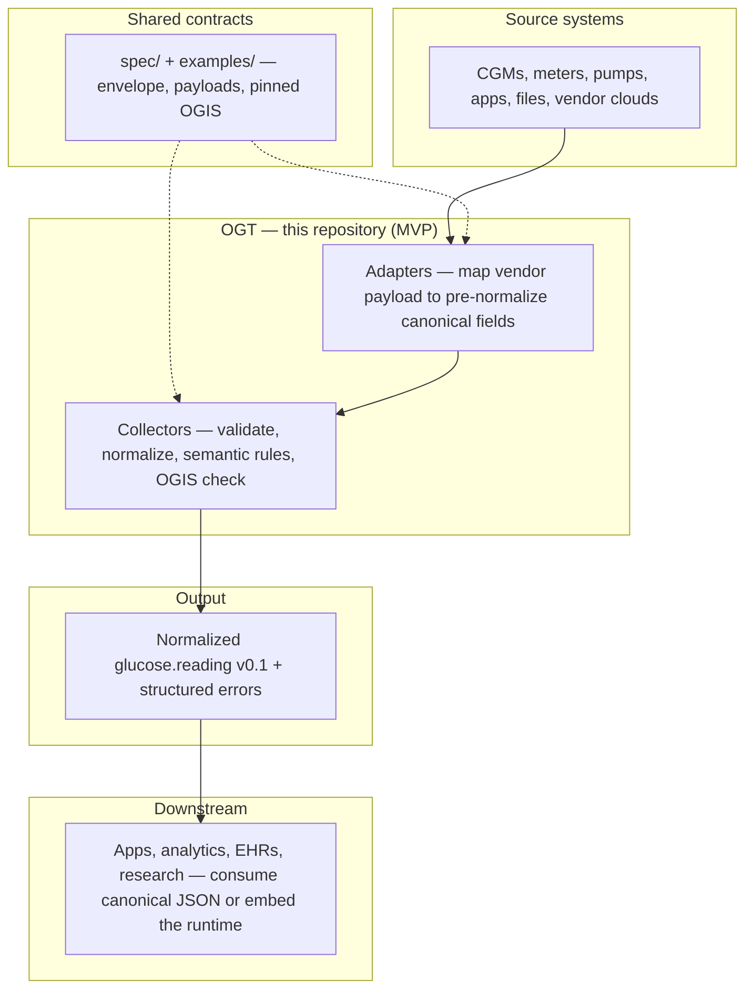

# Open Glucose Telemetry (OGT)

OGT is an open, vendor-neutral telemetry and collection framework for ingesting, validating, normalizing, and streaming glucose-related data across devices, applications, and clinical systems.

## Mission

Glucose data today is fragmented across proprietary vendor APIs, inconsistent schemas, and siloed applications. Every new product must rebuild integrations from scratch.

OGT solves this by providing a unified telemetry layer that enables:

- standardized ingestion of glucose data
- real-time and historical data streaming
- consistent data pipelines across vendors
- seamless integration for apps, AI, and clinical systems

> Integrate once. Stream everywhere.

---

## Short version

OGT sits between source systems and downstream consumers as the runtime framework that ingests raw glucose data, transforms it into OGIS-compliant events, and delivers it through shared query, streaming, and export paths.

---

## Repository structure

The repo is split into **shared contracts** (schemas and golden files) and **language runtimes** (code that implements the same pipeline).

### Top-level folders

| Folder | What it is |
|--------|------------|
| **[`spec/`](./spec/)** | **Contracts.** JSON Schemas for the ingestion envelope, per-`source` payloads, and **pinned** OGIS event shapes (e.g. `glucose.reading` v0.1). This is the language-neutral “truth” runtimes must match. |
| **[`examples/`](./examples/)** | **Golden tests.** Sample ingestion envelopes and expected canonical outputs so TypeScript, Swift, and future runtimes can prove they produce the same results. |
| **[`specifications/`](./specifications/)** | **Program docs.** Plans, handoff notes, parity matrices between runtimes, and completion summaries—not executable pipeline code. |
| **[`runtimes/`](./runtimes/)** | **Implementations.** One subdirectory per language. **Today:** [`typescript/`](./runtimes/typescript/) — reference Node pipeline + `pnpm pipeline`; [`swift/`](./runtimes/swift/) — Swift Package `OpenGlucoseTelemetryRuntime`. Index: [`runtimes/README.md`](./runtimes/README.md). **Not shipped here:** hosted event bus, query APIs, or exporters (see **[Vision: platform beyond this repository](#vision-platform-beyond-this-repository)**). |

### Inside each runtime (`runtimes/<language>/`)

Every runtime follows [`runtimes/RUNTIME-TEMPLATE.md`](./runtimes/RUNTIME-TEMPLATE.md): two responsibilities, mirrored across languages.

| Folder | Responsibility |
|--------|------------------|
| **`collectors/`** | **Orchestration.** Accept an ingestion envelope, validate it, pick the adapter by `source`, run **normalize → semantic rules → optional dedupe → OGIS validation**, return a canonical reading or a structured error. Vendor-specific `if source == …` switches do **not** belong here—routing is table- or plugin-based. |
| **`adapters/`** | **Per-source mapping.** One subfolder per `source` id (e.g. `healthkit/`, `dexcom/`). Each adapter turns vendor **`payload`** JSON into **pre-normalize** fields that match OGIS semantics; the collector finishes units, timestamps, and final schema checks. |

Optional tooling folders: **`dev/`** (TypeScript CLI and scripts), **`examples/`** (Swift sample executable). **`collectors/`** is split into the same conceptual subfolders in **both** runtimes (`core/`, `ingestion/`, `registry/`, `canonical/`, `validation/`, `normalization/`, `tooling/`): TypeScript — [`runtimes/typescript/collectors/README.md`](./runtimes/typescript/collectors/README.md); Swift — [`runtimes/swift/Sources/OpenGlucoseTelemetryRuntime/collectors/README.md`](./runtimes/swift/Sources/OpenGlucoseTelemetryRuntime/collectors/README.md).

---

## Pipeline layers (MVP)

These stages run **in order** inside the collector after an envelope is received. Same meaning in TypeScript and Swift; details per file live in [`RUNTIME-TEMPLATE.md`](./runtimes/RUNTIME-TEMPLATE.md).

| # | Layer | What happens |
|---|--------|----------------|
| 1 | **Ingress** | Read or decode wire JSON into a typed **ingestion envelope** (`source`, `payload`, `trace_id`, `received_at`, `adapter` metadata). |
| 2 | **Envelope validation** | Reject bad wrappers early (empty ids, bad timestamps, non-object `payload`). |
| 3 | **Payload validation** | For the given `source`, enforce allowed keys, required fields, and enums. Unknown `source` → **ADAPTER_UNKNOWN** (no adapter runs). |
| 4 | **Adapter map** | `adapters/<source>/` maps validated payload → **pre-normalize** canonical reading (OGIS field semantics; glucose may still be in mmol/L, timestamps vendor-shaped). |
| 5 | **Normalize** | UTC timestamps, glucose to **mg/dL**, trim/bound strings, fill `received_at` when needed. |
| 6 | **Semantic rules** | Policy checks (e.g. plausible range, clock skew on `observed_at`). |
| 7 | **Dedupe (optional)** | Drop duplicates by subject + observed time + raw event id when enabled. |
| 8 | **OGIS validation** | Final check against pinned **`glucose.reading` v0.1** in [`spec/pinned/`](./spec/pinned/). |
| 9 | **Result** | Success with normalized canonical JSON, or failure with a stable **code** + message + `trace_id` (+ optional `field`). |

**One-line flow:** envelope → validate envelope → validate payload → adapter map → normalize → semantic → [dedupe] → OGIS check → result.

---

## High-level architecture

**OGIS** (Open Glucose Interoperability Standard) defines **what** a glucose event means—schemas, units, timestamps, provenance. **OGT** defines **how** data moves: ingest vendor payloads, validate, normalize, and emit OGIS-shaped events. This repository implements the **ingestion and normalization path**; durable buses, HTTP APIs, and streaming are **not** required to use the contracts in `spec/` and `examples/`.



**How to read the diagram:** Sources produce proprietary or app-specific data. **Adapters** align that data to OGIS field semantics; **collectors** enforce global rules and the pinned schema. **`spec/`** and **`examples/`** anchor behavior across languages. Downstream systems receive a **single normalized shape** instead of re-implementing each vendor.

**Implemented today:** TypeScript reference ([`runtimes/typescript/`](./runtimes/typescript/)) and Swift ([`runtimes/swift/`](./runtimes/swift/)) runtimes, CLI via `pnpm pipeline` and `swift run RunPipelineExample`.

**Roadmap (not the focus of this repo’s MVP):** a durable event bus, query APIs, realtime streams, exporters—these appear in vision sections below as **future** capabilities, not as code you must deploy to use OGT’s pipeline.

---

## For implementers

Use these docs when **implementing a runtime**, **adding a new provider (`source`)**, or **matching golden fixtures**. **[Repository structure](#repository-structure)** and **[Pipeline layers](#pipeline-layers-mvp)** above are the overview; the template has exhaustive file paths.

| Doc | What it covers |
|-----|----------------|
| **[`runtimes/RUNTIME-TEMPLATE.md`](./runtimes/RUNTIME-TEMPLATE.md)** | Full pipeline table, data flow, **adding a new provider**, **adding a new language runtime** |
| **[`runtimes/README.md`](./runtimes/README.md)** | Runtimes index, links to TS / Swift READMEs and architectures |
| **[`runtimes/typescript/ARCHITECTURE.md`](./runtimes/typescript/ARCHITECTURE.md)** | TypeScript `submit()` flow (diagrams) |
| **[`runtimes/swift/ARCHITECTURE.md`](./runtimes/swift/ARCHITECTURE.md)** | Swift collector flow (diagrams) |

---

## Adding a new provider

A **provider** is identified by a **`source`** string on the ingestion envelope (for example `healthkit`, `dexcom`). The collector uses **`source`** to choose the right validator and mapper—nothing else in the envelope tells it which adapter to run. Adding a provider touches **shared contracts first**, then **each language runtime** you maintain.

1. **Pick the `source` id** — Choose one string that will appear as `"source": "<id>"` in JSON forever. **Lowercase** is the convention so you avoid duplicate routes (`HealthKit` vs `healthkit`). Treat it like a **public API identifier**, not a display name: apps, backends, tests, and golden fixtures will all use this exact value. **Renaming later is a breaking change**—old clients would still send the old id, routing would fail (`ADAPTER_UNKNOWN`) or hit the wrong adapter until every sender and stored record is updated or you register both ids during a transition.
2. **Spec and fixtures (repo root, language-agnostic)**  
   - Add a payload JSON Schema under [`spec/`](./spec/) and document it in [`spec/README.md`](./spec/README.md).  
   - Add a golden ingestion file under [`examples/ingestion/`](./examples/ingestion/) and a matching **expected canonical** output under [`examples/canonical/`](./examples/canonical/) (same pipeline output as the reference `submit`).
3. **TypeScript** — Validator in [`runtimes/typescript/collectors/validation/schema-validators.ts`](./runtimes/typescript/collectors/validation/schema-validators.ts), plugin entry in [`registry/ingest-plugins.ts`](./runtimes/typescript/collectors/registry/ingest-plugins.ts), new [`runtimes/typescript/adapters/<source>/`](./runtimes/typescript/adapters/) (`map.ts` + README), tests in [`pipeline.test.ts`](./runtimes/typescript/collectors/pipeline.test.ts). Do **not** add new `if (source)` branches in [`collector-engine.ts`](./runtimes/typescript/collectors/core/collector-engine.ts); use the plugin map.
4. **Swift** — `ogtValidate…Payload` in [`OGTEnvelopeValidator.swift`](./runtimes/swift/Sources/OpenGlucoseTelemetryRuntime/collectors/ingestion/OGTEnvelopeValidator.swift), new adapter under [`runtimes/swift/.../adapters/<source>/`](./runtimes/swift/Sources/OpenGlucoseTelemetryRuntime/adapters/), register `ogtRegistration` in [`OGTAdapterCatalog.swift`](./runtimes/swift/Sources/OpenGlucoseTelemetryRuntime/collectors/registry/OGTAdapterCatalog.swift), tests against the same golden JSON.
5. **Docs** — Adapter README(s) per source; update [`specifications/handoff/OGT-SWIFT-PARITY-MATRIX.md`](./specifications/handoff/OGT-SWIFT-PARITY-MATRIX.md) if behavior intentionally differs from TS.

**Full tables (file-by-file), diagrams, and “what not to duplicate”:** [`runtimes/RUNTIME-TEMPLATE.md`](./runtimes/RUNTIME-TEMPLATE.md) → *Adding a new provider*.

---

## Adding a new language runtime

Use this when introducing a **new folder** under [`runtimes/`](./runtimes/) (for example Kotlin or Rust).

1. **Create `runtimes/<name>/`** using that ecosystem’s build tool (Gradle, Cargo, …).
2. **Match the contract** — Implement **`collectors/`** (orchestration: envelope → validate → route → normalize → semantic → optional dedupe → OGIS check → result) and **`adapters/`** (one subfolder per `source`, vendor payload → **pre-normalize** canonical fields). Stage order must match [`runtimes/RUNTIME-TEMPLATE.md`](./runtimes/RUNTIME-TEMPLATE.md) *Pipeline layers*.
3. **Test against shared fixtures** — Wire CI or local tests to [`examples/`](./examples/) so output matches the TypeScript reference for the same inputs.
4. **Document** — Add `runtimes/<name>/README.md` (build, test, how to run the pipeline on a sample envelope).
5. **Register** — Add a row for the new runtime in [`runtimes/README.md`](./runtimes/README.md).

**Detailed checklist:** [`runtimes/RUNTIME-TEMPLATE.md`](./runtimes/RUNTIME-TEMPLATE.md) → *Adding a new language runtime*.

---

## MVP pipeline (GlucoseAITracker / GAT)

For **Phase 1 MVP**, the **TypeScript runtime** under [`runtimes/typescript/`](./runtimes/typescript/) implements an in-process **ingestion and normalization pipeline**: adapters wrap vendor payloads in an **ingestion envelope**, the collector validates and normalizes, and output is **OGIS `glucose.reading` v0.1** validated against a pinned JSON Schema.

- **OGT (this repo)** — ingestion envelope, adapter contracts, validation orchestration, normalization code (`runtimes/typescript/collectors/`, `runtimes/typescript/adapters/`, `spec/`).
- **OGIS** — canonical event shape and semantics; authoritative schema in the **OpenGlucoseInteroperabilityStandard** (OGIS) repository. OGT pins a copy under [`spec/pinned/`](./spec/pinned/) — see [`spec/pinned/PIN.md`](./spec/pinned/PIN.md).

**Ingestion envelope schema:** [`spec/ingestion-envelope.schema.json`](./spec/ingestion-envelope.schema.json) (field descriptions: [`spec/README.md`](./spec/README.md)).

**Plans and tasks:** [`specifications/README.md`](./specifications/README.md).

**Completion summaries:** [`specifications/summary/OGT-COMPLETION-SUMMARY.md`](./specifications/summary/OGT-COMPLETION-SUMMARY.md) (program rollup) · [OGT-MVP-GAT-COMPLETION-SUMMARY.md](./specifications/summary/OGT-MVP-GAT-COMPLETION-SUMMARY.md) (GAT slice) · [OGT-CROSS-RUNTIME-PARITY-COMPLETION-SUMMARY.md](./specifications/summary/OGT-CROSS-RUNTIME-PARITY-COMPLETION-SUMMARY.md) (parity / consumer docs).

### Reference implementation vs native apps (Swift, etc.)

**Node.js and TypeScript under [`runtimes/typescript/`](./runtimes/typescript/) are a portable reference implementation**, not a requirement for every OGT consumer. They exist so the pipeline can run in CI, power golden tests, and provide readable source for `submit()`-style behavior.

**OGT as a contract** is language-agnostic: the **JSON Schemas** under [`spec/`](./spec/), the **pinned OGIS** [`glucose.reading`](./spec/pinned/glucose.reading.v0_1.json) schema, **examples** under [`examples/`](./examples/), and **adapter field mappings** (e.g. [`runtimes/typescript/adapters/healthkit/README.md`](./runtimes/typescript/adapters/healthkit/README.md), [`runtimes/typescript/adapters/dexcom/README.md`](./runtimes/typescript/adapters/dexcom/README.md)) define what “OGT-compliant” ingestion means.

**Swift** adopters should use [`runtimes/swift/`](./runtimes/swift/) as the home for the Swift Package and implement collector semantics to match golden output. **Native mobile apps** often run the same steps **on device** for offline-friendly, low-latency behavior without shipping a Node runtime. Alignment is proven by **matching fixtures** (same shapes as `examples/ingestion/` → same canonical output as `examples/canonical/`) and by comparing to `pnpm pipeline` output during development. **TS ↔ Swift rule parity** (including known drift such as mmol/L factor and future-timestamp policy) is tracked in [`specifications/handoff/OGT-SWIFT-PARITY-MATRIX.md`](./specifications/handoff/OGT-SWIFT-PARITY-MATRIX.md); optional JSON diff: `pnpm parity:check <a.json> <b.json>` after [`examples/canonical/README.md`](./examples/canonical/README.md).

More detail for the GlucoseAITracker integration: [`specifications/handoff/OGT-GLUCOSE-009-CONSUMPTION.md`](./specifications/handoff/OGT-GLUCOSE-009-CONSUMPTION.md).

### Getting Started (MVP)

From the **repository root**:

```bash
pnpm install
pnpm build
pnpm pipeline examples/ingestion/healthkit-sample.json
pnpm pipeline examples/ingestion/dexcom-sample.json
```

Run tests: `pnpm test`. See [`runtimes/typescript/dev/README.md`](./runtimes/typescript/dev/README.md) for exit codes and the `pipeline:dev` script.

**GlucoseAITracker handoff (GLUCOSE-009):** [`specifications/handoff/OGT-GLUCOSE-009-CONSUMPTION.md`](./specifications/handoff/OGT-GLUCOSE-009-CONSUMPTION.md).

**Swift Package:** [`runtimes/swift/README.md`](./runtimes/swift/README.md), [`runtimes/swift/ARCHITECTURE.md`](./runtimes/swift/ARCHITECTURE.md) — `cd runtimes/swift && swift build && swift test`.

---

## Vision: platform beyond this repository

The **[High-level architecture](#high-level-architecture)** diagram shows what **this repo implements today**: contracts in **`spec/`** / **`examples/`**, plus **adapters** and **collectors** in **`runtimes/`** that output normalized **`glucose.reading`** JSON (or structured errors).

A **full operational platform** might add layers that are **not** shipped here as running services—think durable **event bus**, **query APIs**, **realtime streams**, **exporters** (FHIR, webhooks, warehouse), and **replay / backfill**. Those are **directional** capabilities for the ecosystem; they depend on your deployment and product, not on cloning this repo alone.

**Why this matters:** you can adopt OGT’s **schemas, golden tests, and runtimes** without assuming an event bus or HTTP API exists. When you add those in your environment, they sit **after** the collector’s successful output.

---

## How OGT uses OGIS

OGT depends on OGIS for the meaning of the data.

**OGIS tells OGT:**

- what event types exist
- what required fields must be present
- how timestamps work
- how units must be represented
- what provenance must be preserved
- how alerts, readings, and lifecycle events are structured

**OGT then:**

- ingests source payloads
- maps them into OGIS structures
- validates them
- routes them
- exposes them to downstream systems

So the relationship is:

- **OGIS** defines the standard
- **OGT** implements the standard in motion

In simple terms:

> OGIS defines what glucose data means, and OGT defines how glucose data moves.

---

## The main value of OGT

OGT creates the working operational layer that turns a paper standard into a usable platform.

**Without OGT:**

- every app has to build custom ingestion pipelines
- every vendor integration is siloed
- replay and normalization are inconsistent
- streaming and export paths vary wildly

**With OGT:**

- vendors plug into one telemetry framework
- apps consume one normalized event model
- real-time and historical data share one pipeline
- OGIS becomes practical and enforceable

---

## Design Principles

- **Vendor-neutral** — works across all manufacturers and platforms
- **OGIS-compliant** — enforces standardized glucose semantics
- **Realtime-first** — designed for streaming but supports batch
- **Provenance-first** — all data remains traceable to its origin
- **Time-aware** — distinguishes observed, received, and processed times
- **Extensible** — supports future device types and data domains
- **Observable** — the pipeline itself is monitorable and debuggable
- **Modular** — components can be deployed independently

---

## Example canonical event

```json
{
  "event_type": "glucose.reading",
  "event_version": "1.0",
  "subject_id": "subj_123",
  "device_id": "dev_456",
  "timestamp_observed": "2026-03-28T14:32:00Z",
  "timestamp_received": "2026-03-28T14:33:15Z",
  "glucose": {
    "value": 142,
    "unit": "mg/dL"
  },
  "measurement_source": "interstitial",
  "trend": {
    "direction": "rising"
  },
  "provenance": {
    "source_vendor": "example_vendor",
    "raw_event_id": "evt_789",
    "adapter_version": "0.1.0"
  }
}
```

---

## Example end-to-end usage

### Scenario

A CGM vendor cloud produces a reading.

### Step 1: Source system emits raw data

```json
{
  "sg": 142,
  "u": "mg/dL",
  "time": "2026-03-28T15:05:00Z",
  "trendArrow": 3
}
```

### Step 2: OGT adapter receives it

The cloud adapter:

- authenticates to the vendor API
- fetches the payload
- preserves raw metadata
- converts it into an OGIS-compliant event

### Step 3: OGT collector validates it

The collector ensures:

- schema is valid
- timestamps are correct
- units are explicit
- provenance is present
- event is not duplicated

### Step 4: Downstream use

The **normalized** reading can be persisted, sent to your backend, or passed to UI code. In a larger deployment you might also fan out through an **event bus**, **query APIs**, or **exporters**—those are integration choices **outside** this repository’s MVP pipeline (see **[Vision: platform beyond this repository](#vision-platform-beyond-this-repository)**).

### Step 5: Consumers stay vendor-agnostic

Apps do not need to understand that the source was Abbott, Dexcom, Libre, or a file import—they work with **one canonical shape** after the collector succeeds.

---

## Roadmap (future work)

Longer-term directions include **replay**, **edge/offline** sync, **alert** processing, **derived** metrics, a **policy** engine, **multi-tenant** and **enterprise** deployment profiles, and **hosted** query or streaming APIs. Those sit **on top of** the ingestion pipeline this repo already ships—see **[Getting Started (MVP)](#getting-started-mvp)** to run the current TypeScript and Swift runtimes.

---

## Product vision

A world where glucose data flows through an open, real-time telemetry system instead of vendor-specific silos.

---

## Status

**Draft v0.1.** The **MVP ingestion pipeline** (envelope, adapters, collectors, normalization, OGIS validation, golden fixtures, CLIs) lives under **`runtimes/typescript/`** and **`runtimes/swift/`**, with shared **`spec/`** and **`examples/`**. The project is in early development and is being designed in the open; feedback is welcome from device manufacturers, developers, healthcare organizations, researchers, and contributors.

---

## Contributing

Coming soon — contributions, RFC process, and governance model will be defined in future updates.

## License

This project is licensed under the Apache License 2.0.

Apache 2.0 is a permissive open-source license that allows:

- commercial use
- modification and distribution
- private and enterprise use

It also provides an explicit patent grant from contributors to users.

This license was chosen to maximize adoption across device manufacturers,
developers, healthcare systems, and research organizations.