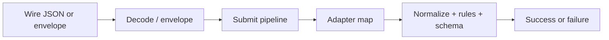
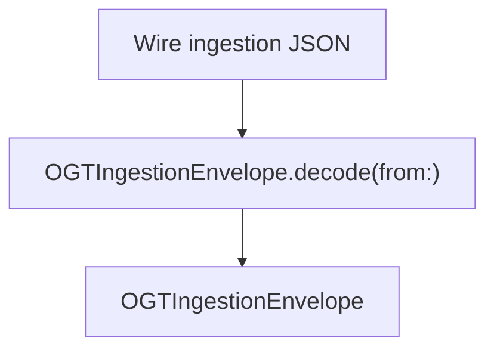
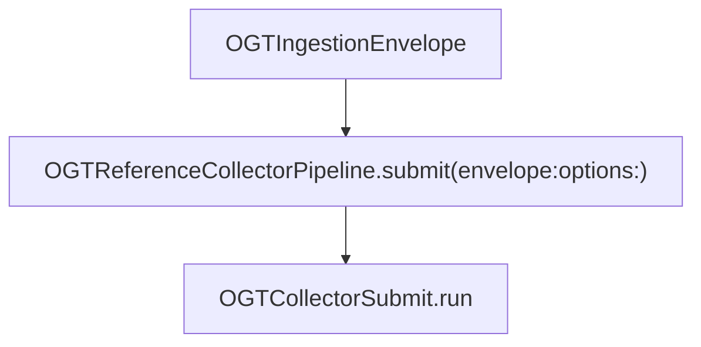
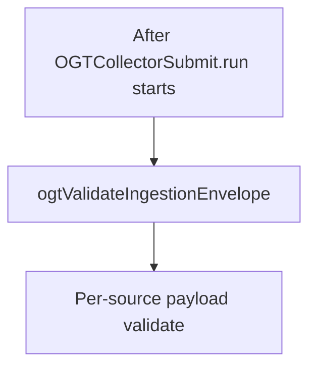
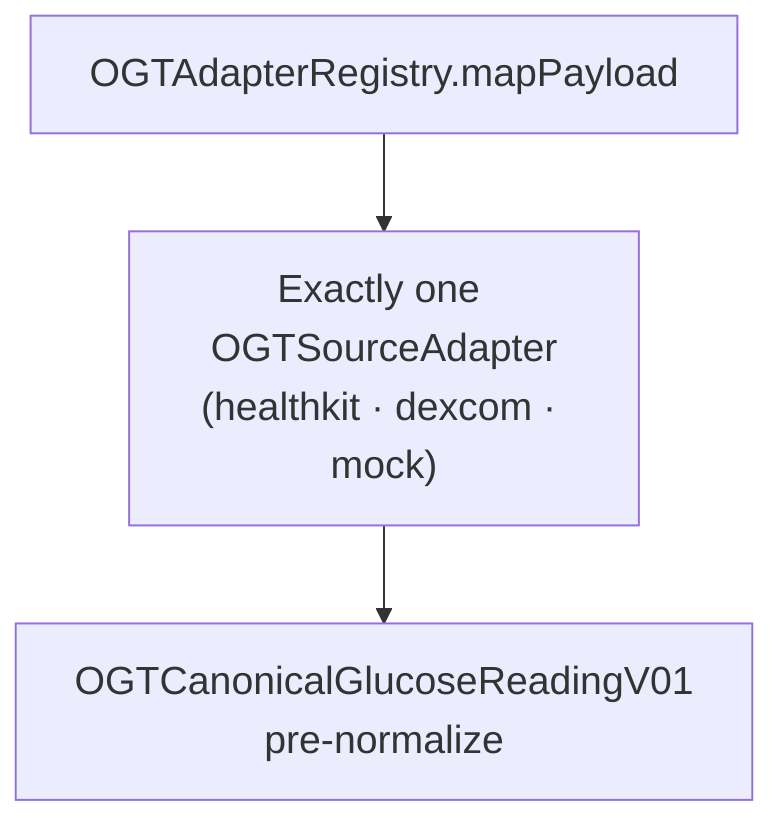
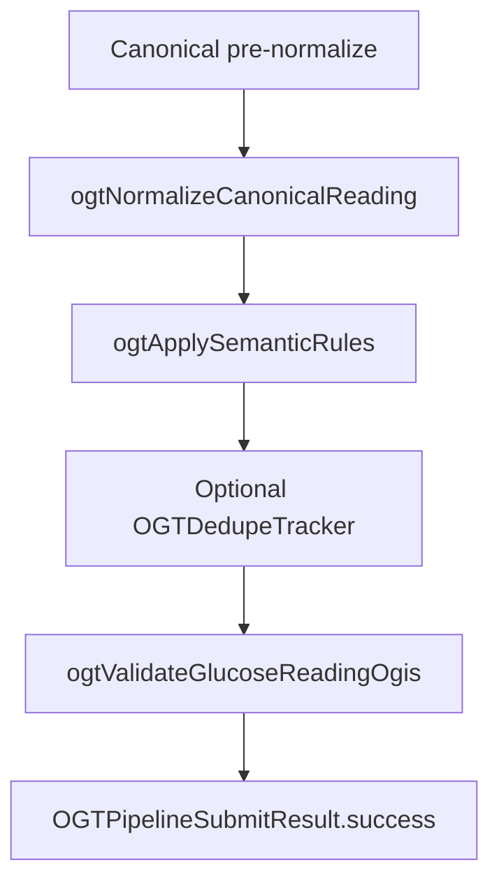
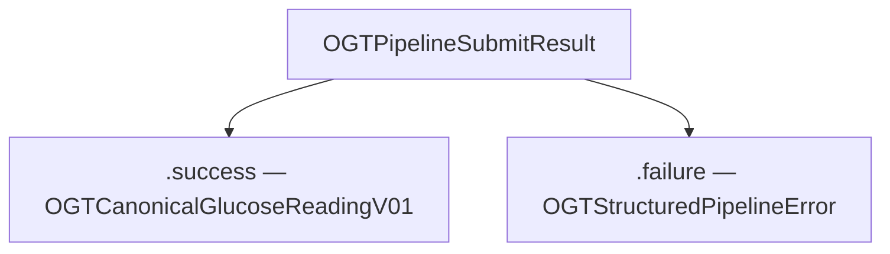

# Swift runtime — reference architecture

This package mirrors the TypeScript layout under `runtimes/typescript/`:

```text
Sources/OpenGlucoseTelemetryRuntime/
├── collectors/
│   ├── OGTCollectorPipeline.swift           # Protocol + OGTReferenceCollectorPipeline
│   ├── OGTCollectorSubmit.swift             # Full submit() parity (validate → map → normalize → …)
│   ├── OGTAdapterRegistry.swift             # Dispatch by source → adapter
│   ├── OGTIngestionEnvelope.swift           # Wire envelope + decode/encode
│   ├── OGTIngestionTypes.swift              # OGTPipelineError (unknown source)
│   ├── OGTJSONValue.swift                   # Dynamic JSON for payloads
│   ├── OGTCanonicalGlucoseReadingV01.swift  # OGIS-shaped canonical model
│   ├── OGTPipelineResult.swift              # OGTPipelineSubmitResult, structured errors
│   ├── OGTEnvelopeAndPayloadValidation.swift
│   ├── OGTNormalize.swift
│   ├── OGTSemantic.swift
│   ├── OGTGlucoseReadingSchemaValidator.swift
│   ├── OGTJSONValueExtractors.swift
│   ├── OGTDedupeTracker.swift / OGTSubmitOptions
│   ├── OGTRepositoryRoot.swift
│   └── README.md
└── adapters/
    ├── OGTSourceAdapter.swift
    ├── healthkit/OGTHealthKitIngestAdapter.swift
    ├── dexcom/OGTDexcomIngestAdapter.swift
    ├── mock/OGTMockIngestAdapter.swift
    └── README.md
```

## Runtime flow

The Swift runtime mirrors TypeScript **`pipeline.ts`** `submit`: decode (or build) an **`OGTIngestionEnvelope`**, run **`OGTReferenceCollectorPipeline.submit`**, get **`OGTPipelineSubmitResult`**. Below, **each diagram is intentionally small** so previews stay readable; read them top to bottom.

**Tooling only (not on this path):** **`OGTRepositoryRoot`** finds the repo `spec/` tree for tests and CLI-style tools.

---

### 1. Bird’s-eye view

**What this layer does:** Frames the **whole runtime** as a straight line from “bytes on the wire” to “one canonical glucose reading or a structured error.” It does not name every function; it shows **where responsibility shifts**: your app or transport owns wire JSON; the library owns validation, mapping, and OGIS-aligned output; the outcome is always a single **`OGTPipelineSubmitResult`**. Use this strip when explaining the system to someone new before drilling into §2–§8.



---

### 2. Ingress → envelope

**What this layer does:** Turns **raw ingestion JSON** into a typed **`OGTIngestionEnvelope`** the rest of the pipeline can consume. Decoding validates JSON structure into **`OGTJSONValue`** for **`payload`** and binds **`source`**, **`received_at`**, **`trace_id`**, and **`adapter`** metadata. This is the **boundary** between unstructured input and the library’s contracts (same fields as [`spec/ingestion-envelope.schema.json`](../../spec/ingestion-envelope.schema.json)). Failures here are usually **parse errors** (thrown from `decode`) rather than pipeline **`ENVELOPE_INVALID`** codes—that code is emitted in the next phase when semantic rules on the envelope fail.



You can also construct **`OGTIngestionEnvelope`** in memory (e.g. from HealthKit in an app) and skip JSON decoding entirely.

---

### 3. Pipeline entry

**What this layer does:** Defines the **public API** you call from production or tests. **`OGTCollectorPipeline`** is the abstraction (useful for mocks); **`OGTReferenceCollectorPipeline`** is the real implementation and forwards to **`OGTCollectorSubmit.run`**, where all stages live. This layer **does not** validate or map yet—it only **hands off** the envelope and **`OGTSubmitOptions`**. Options let you plug in a **test registry** (`adapterRegistry`) or **dedupe** (`dedupeTracker`) without changing call sites.



**Options:** **`OGTSubmitOptions`** — optional **`adapterRegistry`** (default **`OGTDefaultAdapterRegistry`**), optional **`dedupeTracker`**.

---

### 4. Validation (envelope, then payload)

**What this layer does:** Rejects bad input **before** any vendor mapper runs, so adapters can assume a minimal safe shape. **Envelope** checks ensure non-empty `source` / `trace_id` / adapter ids, valid `received_at`, and object **`payload`**. **Payload** checks are **per `source`**: allowed keys, required fields, and basic enums (e.g. glucose **unit**). That mirrors “fail closed” behavior: unknown **`source`** never reaches an adapter—it becomes **`ADAPTER_UNKNOWN`**. Payload extraction errors surface as **`PAYLOAD_INVALID`** with a message suitable for logs or support.



Payload validators (by **`envelope.source`**):

| `source`   | Function                      |
|-----------|-------------------------------|
| `healthkit` | `ogtValidateHealthKitPayload` |
| `mock`      | `ogtValidateMockPayload`      |
| `dexcom`    | `ogtValidateDexcomPayload`    |

Unknown `source` → failure **`ADAPTER_UNKNOWN`** (during payload routing, before **`mapPayload`**).

---

### 5. Adapter dispatch → pre-normalize canonical

**What this layer does:** Maps **vendor-shaped** **`payload`** into the shared **canonical glucose reading** model (**`OGTCanonicalGlucoseReadingV01`**), still **before** unit normalization and timestamp canonicalization. **`OGTAdapterRegistry`** picks **exactly one** **`OGTSourceAdapter`** from **`envelope.source`**; each adapter encodes how HealthKit JSON, Dexcom JSON, or mock JSON maps to **`event_type`**, **`subject_id`**, **`observed_at`**, **`provenance`**, **`device`**, etc. Mapping errors (missing keys, wrong types) return **`PAYLOAD_INVALID`**. This layer is where **source-specific semantics** live; everything after it is **source-agnostic**.



Implementations: **`OGTHealthKitIngestAdapter`**, **`OGTDexcomIngestAdapter`**, **`OGTMockIngestAdapter`** (see `adapters/`).

---

### 6. Post-map chain (success path)

**What this layer does:** Turns adapter output into a **single cross-vendor, OGIS-aligned** reading suitable for storage or downstream APIs. **Normalize** adjusts timestamps to a consistent UTC form, converts glucose to **mg/dL**, trims optional strings, and fills **`received_at`** when absent. **Semantic rules** enforce policy (e.g. plausible glucose range, “not too far in the future”). **Dedupe** (if enabled) drops duplicate logical events using subject + observed time + raw event id. **Schema validation** (`ogtValidateGlucoseReadingOgis`) is a final guard that the object still matches pinned **glucose.reading** v0.1 expectations. Only if every step passes does the pipeline return **`.success`**.



If **`dedupeTracker`** is `nil`, the dedupe step is skipped (no key stored).

---

### 7. Failure codes (where `.failure` comes from)

**What this layer does:** Documents **which stage** produced which **`OGTPipelineIssueCode`** so you can route UX, metrics, or retries correctly. Each failure includes **`traceId`** (from the envelope when valid), **`message`**, optional **`field`**, and **`code`**. Use the table to answer “was this bad JSON, bad glucose, or duplicate?” without re-reading implementation. Codes are stable across Swift and TypeScript for parity.

| Stage | Typical `OGTPipelineIssueCode` |
|--------|--------------------------------|
| Envelope validation | `ENVELOPE_INVALID` |
| Payload / unknown source (validate) | `PAYLOAD_INVALID`, `ADAPTER_UNKNOWN` |
| Registry / adapter map | `PAYLOAD_INVALID`, `ADAPTER_UNKNOWN` |
| Normalize | `MAPPING_FAILED` |
| Semantic rules | `SEMANTIC_INVALID` |
| Dedupe | `DUPLICATE_EVENT` |
| OGIS checks | `CANONICAL_SCHEMA_INVALID` |

---

### 8. Result types

**What this layer does:** Collapses the whole pipeline into an **explicit sum type**: either a **normalized canonical reading** or a **structured error**. **`OGTPipelineSubmitResult`** avoids throwing across the public boundary—callers **`switch`** on **`.success`** / **`.failure`**. On success, **`OGTCanonicalGlucoseReadingV01`** is ready for encoding or handoff to your domain layer. On failure, **`OGTStructuredPipelineError`** carries everything needed for logging and correlation without losing the **`traceId`**.



---

### Pipeline order (text checklist)

1. Decode or build **`OGTIngestionEnvelope`**.  
2. **`OGTReferenceCollectorPipeline().submit(envelope:options:)`**.  
3. Validate envelope → validate payload for `source`.  
4. **`mapPayload`** via registry → **`OGTCanonicalGlucoseReadingV01`**.  
5. Normalize → semantic rules → optional dedupe → **`ogtValidateGlucoseReadingOgis`**.  
6. Return **`.success(reading)`** or **`.failure(error)`**.

## Extension points

1. **Adapters:** implement **`OGTSourceAdapter.mapPayload`** to match each `map.ts` and return **`OGTCanonicalGlucoseReadingV01`** (pre-normalization fields; the collector normalizes and validates).
2. **Registry:** extend **`OGTDefaultAdapterRegistry`** (or inject **`any OGTAdapterRegistry`** via **`OGTSubmitOptions.adapterRegistry`**) for new `source` ids; add matching **`ogtValidate*Payload`** in **`OGTCollectorSubmit`** / **`OGTEnvelopeAndPayloadValidation.swift`**.
3. **Apps (e.g. GlucoseAITracker):** build or decode an **`OGTIngestionEnvelope`**, then call **`OGTReferenceCollectorPipeline().submit(envelope:options:)`** and handle **`OGTPipelineSubmitResult`**.

## Template

See [`../RUNTIME-TEMPLATE.md`](../RUNTIME-TEMPLATE.md) for the cross-language contract.
