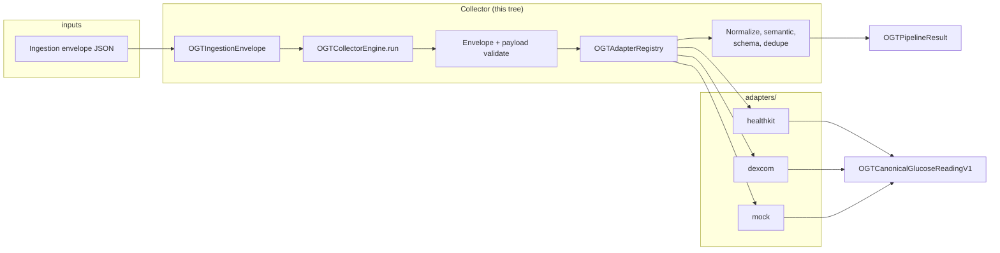

# Collectors (Swift)

The **collector** is the in-process pipeline that sits **after** wire ingestion and runs **validation, adapter routing, normalization, semantic rules, optional dedupe, and OGIS checks** — parity with the TypeScript reference (`runtimes/typescript/collectors/core/collector-engine.ts` — `submit()`, re-exported from `collectors/pipeline.ts`).

## High-level architecture



**Legend:** **`OGTRepositoryRoot`** is **not** in this diagram—it is only for finding the repo `spec/` path in tests and tools, not for processing envelopes in an app.

## Which collector should I use?

| Situation | Use this |
|-----------|-----------|
| **Default — wire envelopes, standard sources** | **`OGTReferenceCollector()`**. It calls **`OGTCollectorEngine.run`** with **`OGTDefaultAdapterRegistry`**. |
| **Tests or custom routing** | Pass **`OGTSubmitOptions(adapterRegistry: MyRegistry())`** to **`submit(envelope:options:)`**, or depend on **`OGTCollectorPipeline`** and inject a test double. |
| **Dedupe** | **`OGTSubmitOptions(dedupeTracker: OGTDedupeTracker())`**. |
| **New `source` ids** | Add payload validation in **`ingestion/OGTEnvelopeValidator.swift`**, register **`static let ogtRegistration`** on the adapter and append to **`OGTAdapterCatalog.builtinRegistrations`**, and implement **`OGTSourceAdapter`**. |
| **App already maps HK → app model (no JSON envelope)** | You can build an **`OGTIngestionEnvelope`** from your model (or decode from JSON) and call **`OGTCollectorPipeline.submit`** for one canonical path. |
| **Locating `spec/` on disk** | **`OGTRepositoryRoot.find(startingAt:)`** — tooling only. |

## What the collector does today

```text
OGTIngestionEnvelope
  → ogtValidateIngestionEnvelope
  → ogtValidateHealthKitPayload | Mock | Dexcom (by source)
  → OGTAdapterRegistry.mapPayload → OGTCanonicalGlucoseReadingV1 (pre-normalize)
  → ogtNormalizeCanonicalReading
  → ogtApplySemanticRules
  → optional OGTDedupeTracker
  → ogtValidateGlucoseReadingOgis
  → OGTPipelineResult
```

## Files (by subfolder)

| Subfolder | Files |
|-----------|--------|
| **`core/`** | **`OGTCollectorPipeline`** + **`OGTReferenceCollector`**; **`OGTCollectorEngine.run`**; **`OGTSubmitOptions`**; **`OGTPipelineResult`**, **`OGTStructuredPipelineError`**, **`OGTPipelineIssueCode`**. |
| **`ingestion/`** | **`OGTIngestionEnvelope`**, **`OGTIngestionTypes`** (`OGTPipelineError`), **`OGTEnvelopeValidator`** (envelope + `ogtValidate*Payload`). |
| **`registry/`** | **`OGTAdapterRegistration`**, **`OGTAdapterCatalog.builtinRegistrations`**, **`OGTAdapterRegistry`** + **`OGTDefaultAdapterRegistry`**. |
| **`canonical/`** | **`OGTCanonicalGlucoseReadingV1`** and related nested types. |
| **`validation/`** | **`OGTGlucoseReadingSchemaValidator`**, **`OGTSemanticValidator`** (`ogtApplySemanticRules`). |
| **`normalization/`** | **`OGTNormalizer`** (`ogtNormalizeCanonicalReading`, …), **`OGTDedupeTracker`**. |
| **`json/`** | **`OGTJSONValue`**, **`OGTJSONValueExtractors`**. |
| **`tooling/`** | **`OGTRepositoryRoot`**. |

## Parity target

**`runtimes/typescript/collectors/core/collector-engine.ts`** (`submit`).

**Example tests:** [`Tests/OpenGlucoseTelemetryRuntimeTests/OGTCollectorAndAdapterExampleTests.swift`](../../../Tests/OpenGlucoseTelemetryRuntimeTests/OGTCollectorAndAdapterExampleTests.swift).

See also: [`ARCHITECTURE.md`](../../../ARCHITECTURE.md), [`RUNTIME-TEMPLATE.md`](../../../../RUNTIME-TEMPLATE.md).
