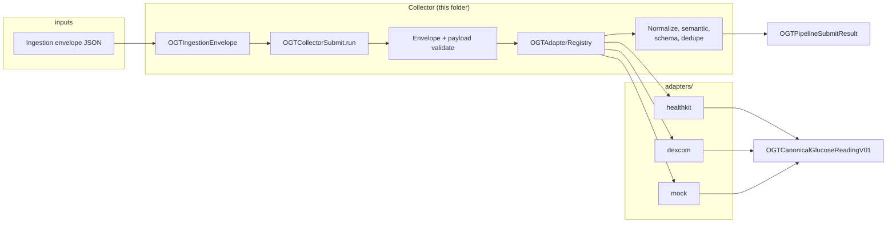

# Collectors (Swift)

The **collector** is the in-process pipeline that sits **after** wire ingestion and runs **validation, adapter routing, normalization, semantic rules, optional dedupe, and OGIS checks** — parity with `runtimes/typescript/collectors/pipeline.ts` (`submit`).

## High-level architecture



**Legend:** **`OGTRepositoryRoot`** is **not** in this diagram—it is only for finding the repo `spec/` path in tests and tools, not for processing envelopes in an app.

## Which collector should I use?

| Situation | Use this |
|-----------|-----------|
| **Default — wire envelopes, standard sources** | **`OGTReferenceCollectorPipeline()`**. It calls **`OGTCollectorSubmit.run`** with **`OGTDefaultAdapterRegistry`**. |
| **Tests or custom routing** | Pass **`OGTSubmitOptions(adapterRegistry: MyRegistry())`** to **`submit(envelope:options:)`**, or depend on **`OGTCollectorPipeline`** and inject a test double. |
| **Dedupe** | **`OGTSubmitOptions(dedupeTracker: OGTDedupeTracker())`**. |
| **New `source` ids** | Add payload validation in **`OGTEnvelopeAndPayloadValidation`** / **`OGTCollectorSubmit.validatePayloadForSource`**, register the adapter in **`OGTDefaultAdapterRegistry`**, and implement **`OGTSourceAdapter`**. |
| **App already maps HK → app model (no JSON envelope)** | You can build an **`OGTIngestionEnvelope`** from your model (or decode from JSON) and call **`OGTCollectorPipeline.submit`** for one canonical path. |
| **Locating `spec/` on disk** | **`OGTRepositoryRoot.find(startingAt:)`** — tooling only. |

## What the collector does today

```text
OGTIngestionEnvelope
  → ogtValidateIngestionEnvelope
  → ogtValidateHealthKitPayload | Mock | Dexcom (by source)
  → OGTAdapterRegistry.mapPayload → OGTCanonicalGlucoseReadingV01 (pre-normalize)
  → ogtNormalizeCanonicalReading
  → ogtApplySemanticRules
  → optional OGTDedupeTracker
  → ogtValidateGlucoseReadingOgis
  → OGTPipelineSubmitResult
```

## Files

| File | Role |
|------|------|
| **`OGTCollectorPipeline.swift`** | **`OGTCollectorPipeline`**: `submit(envelope:options:) -> OGTPipelineSubmitResult`. **`OGTReferenceCollectorPipeline`** forwards to **`OGTCollectorSubmit.run`**. |
| **`OGTCollectorSubmit.swift`** | Full **`submit`** implementation; uses **`OGTSubmitOptions`** for registry + dedupe. |
| **`OGTAdapterRegistry.swift`** | **`OGTAdapterRegistry`** and **`OGTDefaultAdapterRegistry`**. Unknown `source` at mapping time → **`OGTPipelineError.unknownSource`**. |
| **`OGTIngestionEnvelope.swift`** | Wire model + **`decode(from:)`** / **`encodeToJSONData()`**. |
| **`OGTIngestionTypes.swift`** | **`OGTPipelineError`** (registry unknown source). |
| **`OGTPipelineResult.swift`** | **`OGTPipelineSubmitResult`**, **`OGTStructuredPipelineError`**, **`OGTPipelineIssueCode`**. |
| **`OGTCanonicalGlucoseReadingV01.swift`** | Canonical reading model + JSON encoding helper. |
| **`OGTEnvelopeAndPayloadValidation.swift`**, **`OGTNormalize.swift`**, **`OGTSemantic.swift`**, **`OGTGlucoseReadingSchemaValidator.swift`**, **`OGTJSONValueExtractors.swift`** | Parity with TS validators / normalize / semantic / schema. |
| **`OGTDedupeTracker.swift`** | Dedupe + **`OGTSubmitOptions`**. |
| **`OGTJSONValue.swift`** | Dynamic JSON for **`payload`**. |
| **`OGTRepositoryRoot.swift`** | Repo root discovery for tests/tools. |

## Parity target

**`runtimes/typescript/collectors/pipeline.ts`** (`submit`).

**Example tests:** [`Tests/OpenGlucoseTelemetryRuntimeTests/OGTCollectorAndAdapterExampleTests.swift`](../../../Tests/OpenGlucoseTelemetryRuntimeTests/OGTCollectorAndAdapterExampleTests.swift).

See also: [`ARCHITECTURE.md`](../../../ARCHITECTURE.md), [`RUNTIME-TEMPLATE.md`](../../../../RUNTIME-TEMPLATE.md).
