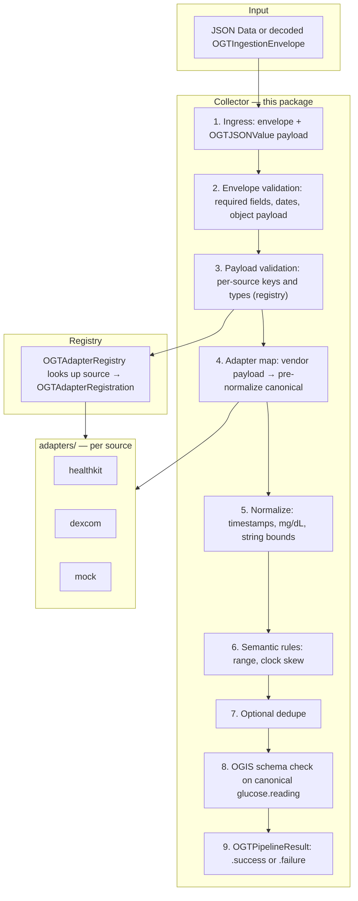

# Collectors (Swift)

The **collector** is the in-process pipeline that runs **after** you have ingestion JSON (or an in-memory **`OGTIngestionEnvelope`**). It validates the envelope and per-source payload, routes to the right **adapter**, normalizes and checks policy, optionally dedupes, validates against the pinned OGIS **`glucose.reading`** shape, and returns either a **canonical reading** or a **structured error**. Behavior matches the TypeScript reference **`submit()`** in [`runtimes/typescript/collectors/core/collector-engine.ts`](../../../../typescript/collectors/core/collector-engine.ts) (re-exported from `collectors/pipeline.ts`).

---

## High-level architecture

End-to-end flow: **wire → envelope → collector → (adapters) → canonical or error**. The diagram is **top-to-bottom** with an enlarged Mermaid font so it stays readable; the numbered layers in the table match the same order as the runtime executes.

**Layers (what each step does)**

| Step | Layer | What happens |
|------|--------|----------------|
| 1 | **Ingress** | The public API accepts an **`OGTIngestionEnvelope`**: `source`, `payload` (dynamic JSON), `trace_id`, `received_at`, `adapter` metadata. |
| 2 | **Envelope validation** | Rejects malformed wrappers before any adapter runs (empty ids, bad `received_at`, non-object `payload`). |
| 3 | **Payload validation** | For the given `source`, enforce allowed keys and required fields. Implemented via the registry; unknown `source` → **`ADAPTER_UNKNOWN`**. |
| 4 | **Adapter map** | **`adapters/<source>/`** maps validated payload into **`OGTCanonicalGlucoseReadingV1`** fields **before** full normalization (units/timestamps may still be vendor-shaped). |
| 5 | **Normalize** | UTC timestamps, glucose to **mg/dL**, trim optional strings, align `received_at` with envelope when needed. |
| 6 | **Semantic rules** | Policy checks (e.g. plausible mg/dL range, “not too far in the future” on `observed_at`). |
| 7 | **Dedupe (optional)** | If **`OGTSubmitOptions.dedupeTracker`** is set, drop duplicate logical events by subject + time + raw event id. |
| 8 | **OGIS validation** | Final check against pinned **`glucose.reading` v0.1** semantics. |
| 9 | **Result** | **`OGTPipelineResult`**: `.success(reading)` or `.failure(error)` with stable **`OGTPipelineIssueCode`**. |

**Not shown:** **`OGTRepositoryRoot`** (`tooling/`) only discovers the repo **spec/** tree for tests and CLI-style tools—it is **not** on the app ingest path.

---

## Which collector should I use?

| Situation | Use this |
|-----------|-----------|
| **Default — wire envelopes, standard sources** | **`OGTReferenceCollector()`**. It calls **`OGTCollectorEngine.run`** with **`OGTDefaultAdapterRegistry`**. |
| **Tests or custom routing** | Pass **`OGTSubmitOptions(adapterRegistry: MyRegistry())`** to **`submit(envelope:options:)`**, or depend on **`OGTCollectorPipeline`** and inject a test double. |
| **Dedupe** | **`OGTSubmitOptions(dedupeTracker: OGTDedupeTracker())`**. |
| **New `source` ids** | Add payload validation in **`ingestion/OGTEnvelopeValidator.swift`**, register **`static let ogtRegistration`** on the adapter and append to **`OGTAdapterCatalog.builtinRegistrations`**, and implement **`OGTSourceAdapter`**. |
| **App already maps HK → app model (no JSON envelope)** | You can build an **`OGTIngestionEnvelope`** from your model (or decode from JSON) and call **`OGTCollectorPipeline.submit`** for one canonical path. |
| **Locating `spec/` on disk** | **`OGTRepositoryRoot.find(startingAt:)`** — tooling only. |

---

## What the collector does today

In one sentence: the collector **turns one ingestion envelope into one validated OGIS-shaped glucose reading or a structured error**, with **no per-source `switch`** in the engine—routing is **table-based** via the registry.

**Concrete pipeline (same order as production):**

1. **`OGTCollectorEngine.run`** receives **`OGTIngestionEnvelope`** + **`OGTSubmitOptions`**.
2. **`ogtValidateIngestionEnvelope`** — fail fast with **`ENVELOPE_INVALID`** if the wrapper is wrong.
3. **`OGTAdapterRegistry.validatePayload`** — for the envelope’s `source`, run the registered validator (e.g. **`ogtValidateHealthKitPayload`**). Unknown source → **`ADAPTER_UNKNOWN`**; bad keys/types → **`PAYLOAD_INVALID`**.
4. **`OGTAdapterRegistry.mapPayload`** — call the adapter’s **`mapPayload`** → **`OGTCanonicalGlucoseReadingV1`** (pre-normalize).
5. **`ogtNormalizeCanonicalReading`** — timestamps, mg/dL, string bounds; failures surface as **`MAPPING_FAILED`** where applicable.
6. **`ogtApplySemanticRules`** — range and time policy; may return **`SEMANTIC_INVALID`**.
7. **`OGTDedupeTracker`** (if provided) — duplicate key → **`DUPLICATE_EVENT`**.
8. **`ogtValidateGlucoseReadingOgis`** — final pin against OGIS rules; **`CANONICAL_SCHEMA_INVALID`** if invalid.
9. Return **`.success(normalized)`** or **`.failure(OGTStructuredPipelineError)`** with **`trace_id`** and optional **`field`**.

Adapters do **not** reimplement steps 5–8; they only produce **pre-normalize** canonical fields for step 4.

---

## Files by subfolder

Each folder has a **single responsibility**. Add new code in the folder that matches the concern (e.g. new payload rules → **`ingestion/`**, new source → **`adapters/`** + registry).

| Subfolder | Purpose | What goes here |
|-----------|---------|----------------|
| **`core/`** | **Public pipeline API and outcome types.** | **`OGTCollectorPipeline`** protocol + **`OGTReferenceCollector`** implementation; **`OGTCollectorEngine.run`** (the full stage chain); **`OGTSubmitOptions`**; **`OGTPipelineResult`**, **`OGTStructuredPipelineError`**, **`OGTPipelineIssueCode`**. *Do not* put per-source mapping here. |
| **`ingestion/`** | **Wire envelope and envelope-level validation.** | **`OGTIngestionEnvelope`** encode/decode; **`OGTIngestionTypes`** (`OGTPipelineError` for unknown registry source); **`OGTEnvelopeValidator`** — **`ogtValidateIngestionEnvelope`** plus **`ogtValidate*Payload`** functions for each supported `source`. Add new **`ogtValidate…Payload`** when you add a provider. |
| **`registry/`** | **Pluggable routing** (validate + map per `source`). | **`OGTAdapterRegistration`**, **`OGTAdapterCatalog.builtinRegistrations`**, **`OGTAdapterRegistry`** / **`OGTDefaultAdapterRegistry`**. Append **`YourAdapter.ogtRegistration`** when adding a built-in source. |
| **`canonical/`** | **OGIS-aligned canonical reading model** for the pipeline. | **`OGTCanonicalGlucoseReadingV1`** and nested types; JSON encoding helpers. Adapter output targets this shape **before** normalization. |
| **`validation/`** | **Post-map checks** that are not vendor-specific. | **`OGTGlucoseReadingSchemaValidator`** — final OGIS-shaped checks; **`OGTSemanticValidator`** — **`ogtApplySemanticRules`**. |
| **`normalization/`** | **Cross-vendor normalization and optional dedupe.** | **`OGTNormalizer`** — **`ogtNormalizeCanonicalReading`**, timestamp helpers, mg/dL; **`OGTDedupeTracker`**. |
| **`json/`** | **Dynamic JSON for `payload`.** | **`OGTJSONValue`**, **`OGTJSONValueExtractors`** — parsing and safe extraction for adapter code. |
| **`tooling/`** | **Repo root discovery for tests/tools.** | **`OGTRepositoryRoot`**. Not used in production ingest. |

**Entry point:** Callers typically import **`OpenGlucoseTelemetryRuntime`** and use **`OGTReferenceCollector`** or **`OGTCollectorEngine.run`**; see **`core/`** for the exact types.

---

## Reference implementation and examples

The **behavioral reference** for this pipeline is the TypeScript runtime’s **`submit()`** implementation: [`runtimes/typescript/collectors/core/collector-engine.ts`](../../../../typescript/collectors/core/collector-engine.ts). Golden JSON under the repo **[`examples/`](../../../../../examples/)** (`ingestion/` and `canonical/`) is the shared contract for cross-runtime checks.

**Automated examples in this package:**

- **[`Tests/OpenGlucoseTelemetryRuntimeTests/OGTCollectorAndAdapterExampleTests.swift`](../../../Tests/OpenGlucoseTelemetryRuntimeTests/OGTCollectorAndAdapterExampleTests.swift)** — how to wire the default registry, inject a stub registry, and use **`OGTCollectorPipeline`**.
- **[`Tests/OpenGlucoseTelemetryRuntimeTests/OGTCollectorPipelineTests.swift`](../../../Tests/OpenGlucoseTelemetryRuntimeTests/OGTCollectorPipelineTests.swift)** — golden fixtures (e.g. HealthKit sample JSON) and error cases.

**Further reading:** [`ARCHITECTURE.md`](../../../ARCHITECTURE.md), [`RUNTIME-TEMPLATE.md`](../../../../RUNTIME-TEMPLATE.md).
