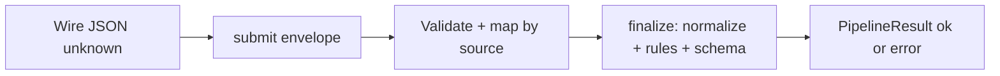
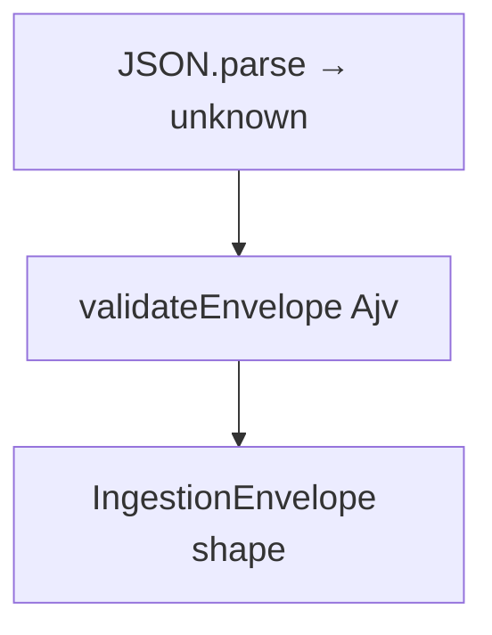
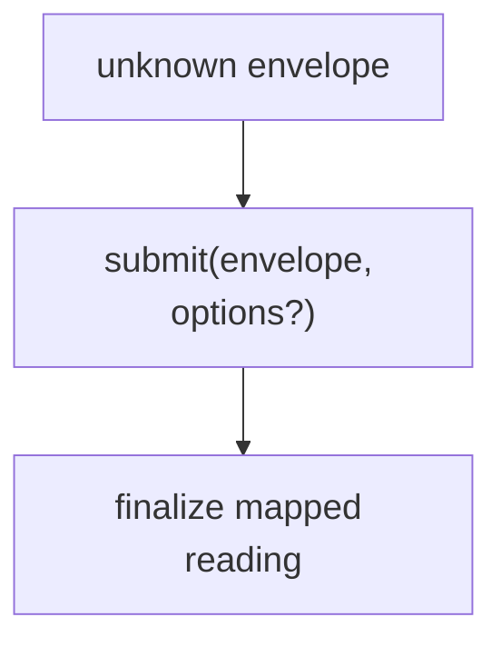
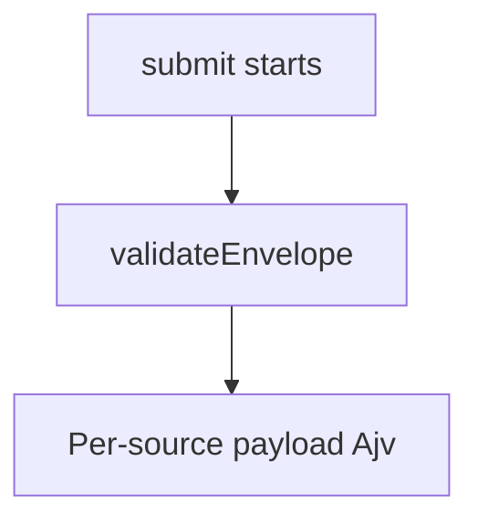
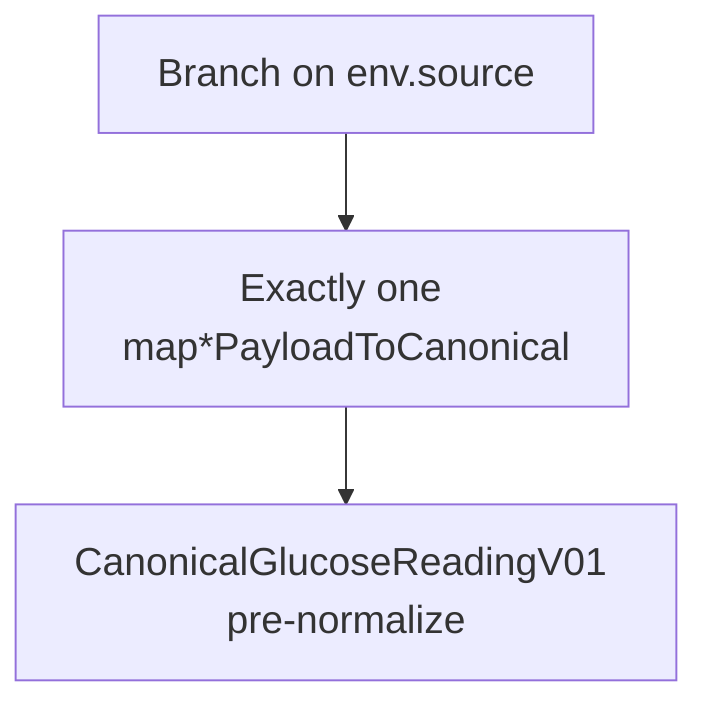
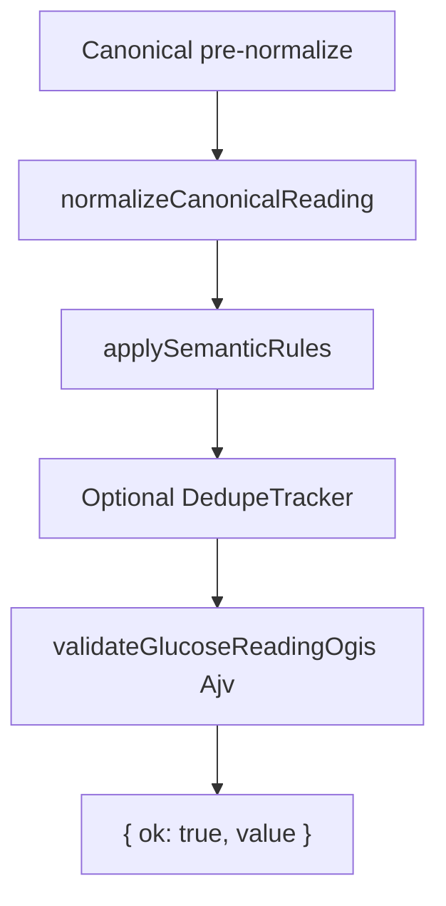
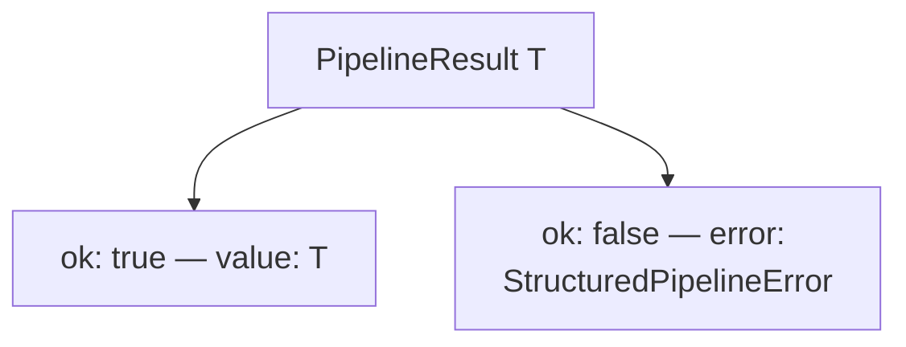

# TypeScript runtime — reference architecture

This package is the **reference** layout for other Open Glucose Telemetry runtimes (see [`../swift`](../swift)). Source layout:

```text
runtimes/typescript/
├── collectors/
│   ├── pipeline.ts           # submit(), finalize() — main entry
│   ├── validators.ts         # Ajv: envelope, payloads, OGIS glucose.reading
│   ├── normalize.ts          # CanonicalGlucoseReadingV01 normalization
│   ├── semantic.ts           # applySemanticRules
│   ├── dedupe.ts             # DedupeTracker
│   ├── errors.ts             # PipelineResult, StructuredPipelineError, codes
│   ├── paths.ts              # specPaths.repoRoot + schema paths (tests / validators)
│   ├── schema-load.ts        # Ajv schema compilation helpers
│   ├── pipeline.test.ts
│   ├── normalize.test.ts
│   └── README.md
├── adapters/
│   ├── healthkit/map.ts
│   ├── dexcom/map.ts
│   ├── mock/map.ts
│   └── README.md
└── dev/
    ├── run-pipeline.ts       # CLI: JSON file → submit → stdout
    ├── parity-check.mjs
    └── README.md
```

---

## Runtime flow

**`submit(envelope, options?)`** in [`collectors/pipeline.ts`](./collectors/pipeline.ts) accepts **`unknown`** (typically `JSON.parse` output), validates with **Ajv**, routes by **`source`**, then **`finalize()`** runs normalize → semantic → optional dedupe → OGIS validation. Diagrams below are **small** so previews stay readable; read top to bottom.

**Tooling only:** **`specPaths`** ([`paths.ts`](./collectors/paths.ts)) walks up to the repo root for schema files; **`dev/run-pipeline.ts`** is a CLI smoke test, not an app SDK.

---

### 1. Bird’s-eye view

**What this layer does:** Summarizes the **reference runtime** as one horizontal story: untyped JSON goes in, **`submit`** runs validation and mapping, **`finalize`** normalizes and checks policy and schema, and a **`PipelineResult`** comes out. It is the map you show before walking file-by-file. Sections 2–8 unpack each box.



---

### 2. Ingress → envelope

**What this layer does:** At the TypeScript boundary, ingestion is **`unknown`** until **Ajv** proves it matches the **ingestion envelope** JSON Schema. **`JSON.parse`** only guarantees syntax, not shape; **`validateEnvelope`** is the first **semantic gate** (required fields, `received_at` format, object **`payload`**, etc.). Once it passes, the value is treated as **`IngestionEnvelope`** for the rest of **`submit`**. Failures return **`ENVELOPE_INVALID`** with Ajv error text—there is no separate decode type like Swift’s `decode(from:)`; the schema validator **is** the decode contract.



`IngestionEnvelope` is defined in [`pipeline.ts`](./collectors/pipeline.ts); wire shape matches [`spec/ingestion-envelope.schema.json`](../../spec/ingestion-envelope.schema.json).

---

### 3. Pipeline entry

**What this layer does:** **`submit`** is the **single public entry** for the MVP pipeline. It owns **routing**: after envelope validation, it branches on **`env.source`**, runs the right **payload** validator and **adapter** **`map*PayloadToCanonical`**, then hands every successful map to **`finalize`**. So “pipeline entry” here means both **orchestration** and **per-source wiring** in one function—unlike Swift, there is no separate **`OGTCollectorPipeline`** type. **`finalize`** is shared: normalize, semantic, dedupe, and OGIS validation run identically for every source.



**Options:** **`SubmitOptions`** — optional **`dedupe`** (`DedupeTracker`), applied inside **`finalize`**. There is **no** injectable registry; routing is **inline** on **`env.source`**.

---

### 4. Validation (envelope, then payload)

**What this layer does:** Ensures wire data matches **JSON Schema** before calling vendor mappers. **Envelope** validation uses the shared ingestion schema. **Payload** validation is **per `source`** via dedicated Ajv validators in [`validators.ts`](./collectors/validators.ts), backed by **`spec/*-payload.schema.json`**. That keeps adapters free to assume shape and focus on field semantics. Unknown **`source`** skips payload validation and returns **`ADAPTER_UNKNOWN`** immediately—no adapter runs.



| `source`   | Validator (Ajv)              |
|-----------|------------------------------|
| `healthkit` | `validateHealthkitPayload` |
| `mock`      | `validateMockPayload`      |
| `dexcom`    | `validateDexcomPayload`    |

Unknown `source` → **`ADAPTER_UNKNOWN`** (no payload validation, no **`finalize`**).

---

### 5. Adapter dispatch → pre-normalize canonical

**What this layer does:** Converts **validated** vendor **`payload`** into **`CanonicalGlucoseReadingV01`** fields (snake_case wire shape toward OGIS) **before** normalization. Dispatch is an **`if / else` chain** on **`env.source`**, each arm calling one function from [`adapters/`](./adapters/). This is the TypeScript equivalent of Swift’s **registry + `mapPayload`**: same separation of concerns, different mechanism. Bugs in mapping typically surface as **`PAYLOAD_INVALID`** if types don’t match expectations, or later as **`MAPPING_FAILED`** / **`SEMANTIC_INVALID`** / **`CANONICAL_SCHEMA_INVALID`** after **`finalize`**.



Functions: **`mapHealthKitPayloadToCanonical`**, **`mapDexcomPayloadToCanonical`**, **`mapMockPayloadToCanonical`** from [`adapters/`](./adapters/).

---

### 6. Post-map chain (inside `finalize`)

**What this layer does:** **`finalize`** is **source-agnostic**: it takes any adapter-produced **`CanonicalGlucoseReadingV01`** and applies the same cross-vendor steps as Swift. **Normalize** canonicalizes timestamps and glucose units (**mg/dL**). **Semantic rules** enforce policy (range, clock skew, etc.). **Dedupe** optionally rejects duplicate keys. **validateGlucoseReadingOgis** runs **Ajv** against the pinned **`glucose.reading`** v0.1 schema. Together, these steps guarantee that **`{ ok: true, value }`** is both **policy-clean** and **schema-valid** for downstream consumers.



If **`options.dedupe`** is omitted, dedupe is skipped.

---

### 7. Failure codes

**What this layer does:** Maps **pipeline stages** to **`PipelineIssueCode`** strings defined in [`errors.ts`](./collectors/errors.ts). Use it when building dashboards, API responses, or retry logic. **`StructuredPipelineError`** always includes **`trace_id`** (from the envelope when available), **`message`** (often Ajv-formatted on TS), and optional **`field`**. Codes align with Swift’s **`OGTPipelineIssueCode`** for cross-runtime parity.

| Stage | Typical `PipelineIssueCode` |
|--------|---------------------------|
| Envelope (Ajv) | `ENVELOPE_INVALID` |
| Payload (Ajv) | `PAYLOAD_INVALID` |
| Unknown `source` | `ADAPTER_UNKNOWN` |
| Normalize (throws) | `MAPPING_FAILED` |
| Semantic rules | `SEMANTIC_INVALID` |
| Dedupe | `DUPLICATE_EVENT` |
| OGIS schema (Ajv) | `CANONICAL_SCHEMA_INVALID` |

---

### 8. Result type

**What this layer does:** **`PipelineResult<T>`** is a **discriminated union**: check **`result.ok`** before reading **`value`** or **`error`**. This is the TypeScript idiom for the same idea as Swift’s **`OGTPipelineSubmitResult`**. Success means **`value`** is the **fully finalized** canonical reading. Failure means **`error`** is safe to log or return from an API without throwing—**`submit`** does not throw for validation failures.



See [`collectors/errors.ts`](./collectors/errors.ts).

---

### Pipeline order (text checklist)

1. Parse JSON to **`unknown`** (or pass a plain object).  
2. **`submit(envelope, options?)`**.  
3. **`validateEnvelope`** → by **`source`**, **`validate*Payload`**.  
4. Call the matching **`map*PayloadToCanonical`**.  
5. **`finalize`**: **`normalizeCanonicalReading`** → **`applySemanticRules`** → optional **`DedupeTracker`** → **`validateGlucoseReadingOgis`**.  
6. Return **`{ ok: true, value }`** or **`{ ok: false, error }`**.

---

## Extension points

1. **Adapters:** add **`adapters/<source>/map.ts`** and export **`map*PayloadToCanonical`** consistent with pinned canonical shape before normalization.  
2. **Pipeline:** add a branch in **`submit()`** for the new **`source`**, wire **`validators.ts`** (Ajv) for that payload, then call your mapper and **`finalize`**.  
3. **Schemas:** extend JSON Schema under [`../../spec`](../../spec) when wire shapes change; keep **`specPaths`** and validator compilation in sync.

---

## Comparison with Swift (same architecture, different mechanics)

| | TypeScript | Swift |
|---|------------|--------|
| Entry | **`submit()`** | **`OGTReferenceCollectorPipeline.submit`** → **`OGTCollectorSubmit.run`** |
| Routing | Inline **`if`** on **`source`** | **`OGTAdapterRegistry`** / **`OGTDefaultAdapterRegistry`** |
| Validation | **Ajv** + JSON Schema | Hand-written checks (parity intent) |
| Options | **`{ dedupe? }`** | **`dedupeTracker`** + optional **`adapterRegistry`** |
| Result | **`PipelineResult<T>`** (`ok` discriminant) | **`OGTPipelineSubmitResult`** (enum) |

---

## Template

See [`../RUNTIME-TEMPLATE.md`](../RUNTIME-TEMPLATE.md) for the cross-language contract.
