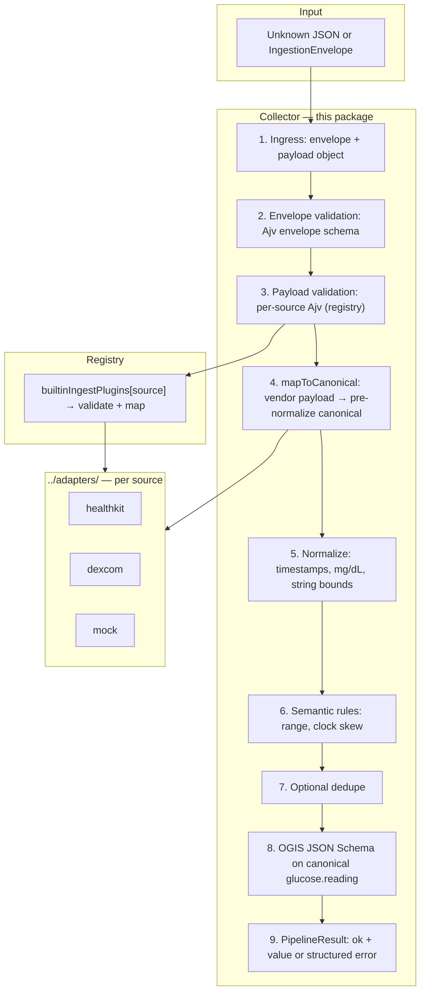

# Collectors (TypeScript)

**Package overview:** [`../README.md`](../README.md) · **Architecture diagrams:** [`../ARCHITECTURE.md`](../ARCHITECTURE.md)

The **collector** is the in-process pipeline that runs **after** wire ingestion (or an in-memory **`IngestionEnvelope`**). It validates the envelope and per-source payload, routes through **`builtinIngestPlugins`**, normalizes and applies semantic rules, optionally dedupes, validates against the pinned OGIS **`glucose.reading`** JSON Schema, and returns either **`{ ok: true, value }`** or **`{ ok: false, error }`**. This package is the **reference implementation** for the same stage order as Swift **`OGTCollectorEngine.run`** ([`../../swift/Sources/OpenGlucoseTelemetryRuntime/collectors/core/OGTCollectorEngine.swift`](../../swift/Sources/OpenGlucoseTelemetryRuntime/collectors/core/OGTCollectorEngine.swift)).

---

## High-level architecture

End-to-end flow: **wire → envelope → collector → (adapters) → canonical or error**. The diagram is **top-to-bottom** with an enlarged Mermaid font so it stays readable; the numbered layers in the table match **`submit()`** in [`core/collector-engine.ts`](./core/collector-engine.ts).

**Layers (what each step does)**

| Step | Layer | What happens |
|------|--------|----------------|
| 1 | **Ingress** | **`submit(envelope, options?)`** accepts **`unknown`** (decoded JSON) and casts to **`IngestionEnvelope`** after envelope validation. |
| 2 | **Envelope validation** | **`validateEnvelope`** (Ajv) rejects malformed wrappers before any plugin runs. |
| 3 | **Payload validation** | **`plugin.validatePayload`** uses per-source Ajv validators from [`validation/schema-validators.ts`](./validation/schema-validators.ts). Missing plugin → **`ADAPTER_UNKNOWN`**. |
| 4 | **Adapter map** | **[`../adapters/`](../adapters/)** `map*.ts` files turn validated **`payload`** into **`CanonicalGlucoseReadingV01`** **before** full normalization. Wired only via [`registry/ingest-plugins.ts`](./registry/ingest-plugins.ts). |
| 5 | **Normalize** | **`normalizeCanonicalReading`** — UTC timestamps, glucose to **mg/dL**, optional string hygiene, align with envelope **`received_at`**. |
| 6 | **Semantic rules** | **`applySemanticRules`** — policy checks (e.g. plausible mg/dL range, time bounds on **`observed_at`**). |
| 7 | **Dedupe (optional)** | If **`options.dedupe`** is set, **`DedupeTracker`** rejects duplicate logical keys. |
| 8 | **OGIS validation** | **`validateGlucoseReadingOgis`** (Ajv) — final pin against pinned schema under **`spec/pinned/`**. |
| 9 | **Result** | **`PipelineResult<CanonicalGlucoseReadingV01>`** — **`PipelineIssueCode`** on failure. |

**Note:** **`tooling/paths.ts`** resolves the repo root so validators and tests can load **`spec/`** and **`examples/`**; it is not a per-request network hop.

---

## Which API should I use?

| Situation | Use this |
|-----------|-----------|
| **Default — golden envelopes, built-in sources** | **`import { submit } from "./collectors/pipeline.js"`** (or the package export your app wires up). Implementation: **`submit()`** in [`core/collector-engine.ts`](./core/collector-engine.ts). |
| **Dedupe** | **`SubmitOptions`** with **`dedupe: new DedupeTracker()`** (re-exported from [`pipeline.ts`](./pipeline.ts)). |
| **New `source` ids** | Add Ajv validators in [`validation/schema-validators.ts`](./validation/schema-validators.ts), add **`map*.ts`** under [`../adapters/`](../adapters/), and register **`builtinIngestPlugins[source]`** in [`registry/ingest-plugins.ts`](./registry/ingest-plugins.ts). **Do not** add `if (source === …)` chains to the engine. |
| **Type-only imports** | **`IngestionEnvelope`**, **`CanonicalGlucoseReadingV01`**, **`PipelineResult`**, **`PipelineIssueCode`** from [`pipeline.ts`](./pipeline.ts). |
| **Per-test custom routing** | There is **no** injectable registry (unlike Swift’s **`OGTSubmitOptions.adapterRegistry`**). For tests, call **`submit`** with envelopes only, or wrap **`submit`** / isolate **`builtinIngestPlugins`** in a test harness. |

---

## What the collector does today

In one sentence: **`submit`** turns one ingestion envelope into one validated OGIS-shaped **`CanonicalGlucoseReadingV01`** or a **structured error**, with **no per-source `if` chain** in the engine—routing is the **`builtinIngestPlugins`** table.

**Concrete pipeline (same order as production; mirrors Swift’s nine-step list):**

1. **`submit(envelope, options?)`** — resolves **`trace_id`** for error reporting (including before a valid cast).
2. **`validateEnvelope`** — **`ENVELOPE_INVALID`** with Ajv error text if the wrapper fails schema.
3. **`builtinIngestPlugins[env.source]`** — missing → **`ADAPTER_UNKNOWN`** (field **`source`**). Else **`plugin.validatePayload`** — **`PAYLOAD_INVALID`** with **`plugin.payloadValidationErrors()`** when Ajv fails.
4. **`plugin.mapToCanonical(payload, env)`** — pre-normalize **`CanonicalGlucoseReadingV01`** (implementations live under **[`../adapters/`](../adapters/)**).
5. **`normalizeCanonicalReading`** (inside **`finalize`**) — throws → **`MAPPING_FAILED`**.
6. **`applySemanticRules`** — non-null → **`SEMANTIC_INVALID`**.
7. **`options.dedupe`** (if set) — duplicate key → **`DUPLICATE_EVENT`**.
8. **`validateGlucoseReadingOgis`** — fails → **`CANONICAL_SCHEMA_INVALID`** with Ajv errors.
9. **`PipelineResult`** — **`{ ok: true, value: normalized }`** or **`{ ok: false, error }`** with **`trace_id`** and optional **`field`**.

Adapters do **not** reimplement steps 5–8; they only supply step 4 (pre-normalize canonical fields).

---

## Files by subfolder

Each folder has a **single responsibility**. Per-source mapping code lives under **[`../adapters/`](../adapters/)** and is **registered** here—do not put vendor mapping inside **`collector-engine.ts`**.

| Subfolder | Purpose | What goes here |
|-----------|---------|----------------|
| **`core/`** | **Public pipeline API and outcome types.** | **`collector-engine.ts`** — **`submit()`** + internal **`finalize()`**; **`pipeline-result.ts`** — **`PipelineResult`**, **`StructuredPipelineError`**, **`PipelineIssueCode`**; **`submit-options.ts`** — **`SubmitOptions`** (`dedupe`). |
| **`ingestion/`** | **Wire envelope TypeScript shape.** | **`ingestion-types.ts`** — **`IngestionEnvelope`** fields aligned with OGT ingestion JSON. |
| **`registry/`** | **Pluggable validate + map per `source`.** | **`ingest-plugins.ts`** — **`builtinIngestPlugins`** table linking Ajv validators to **`../adapters/`** map functions. Append a new entry when you add a built-in source. |
| **`canonical/`** | **OGIS-aligned canonical reading model.** | **`canonical-glucose-reading.ts`** — **`CanonicalGlucoseReadingV01`**; adapter output targets this shape **before** normalization. |
| **`validation/`** | **Ajv: envelope, per-source payloads, OGIS glucose.reading.** | **`schema-validators.ts`** — compiled **`ValidateFunction`** instances and **`validateGlucoseReadingOgis`**; **`semantic.ts`** — **`applySemanticRules`**. |
| **`normalization/`** | **Cross-vendor normalization and optional dedupe.** | **`normalize.ts`** — **`normalizeCanonicalReading`**, helpers; **`dedupe.ts`** — **`DedupeTracker`**. |
| **`tooling/`** | **Repo paths and schema file loading (Node).** | **`paths.ts`** — **`specPaths.repoRoot`** etc.; **`schema-load.ts`** — read JSON Schema files for Ajv setup. Used when validators initialize and in tests—not per-envelope I/O in the hot path beyond file-backed schema compile. |

There is **no** separate **`json/`** tree: dynamic **`payload`** is **`unknown` / `Record<string, unknown>`** plus Ajv, unlike Swift’s **`OGTJSONValue`**.

**Public entry:** [`pipeline.ts`](./pipeline.ts) re-exports **`submit`**, types, and **`DedupeTracker`** for a stable import path (`import { submit } from "./collectors/pipeline.js"`).

---

## Reference implementation and examples

This TypeScript **`submit()`** is the **behavioral reference** other runtimes mirror (see [`specifications/handoff/OGT-SWIFT-PARITY-MATRIX.md`](../../../specifications/handoff/OGT-SWIFT-PARITY-MATRIX.md)). Swift parity entry point: [`../../swift/Sources/OpenGlucoseTelemetryRuntime/collectors/core/OGTCollectorEngine.swift`](../../swift/Sources/OpenGlucoseTelemetryRuntime/collectors/core/OGTCollectorEngine.swift).

**Golden JSON** under **[`examples/`](../../../examples/)** (`ingestion/` and `canonical/`) is the shared contract for cross-runtime checks. See [`examples/canonical/README.md`](../../../examples/canonical/README.md).

**Automated examples in this package:**

- **[`pipeline.test.ts`](./pipeline.test.ts)** — HealthKit and Dexcom golden fixtures, mock adapter, **`ADAPTER_UNKNOWN`**, **`ENVELOPE_INVALID`**, dedupe, and related cases.

**Further reading:** [`../ARCHITECTURE.md`](../ARCHITECTURE.md), [`../../RUNTIME-TEMPLATE.md`](../../RUNTIME-TEMPLATE.md).
